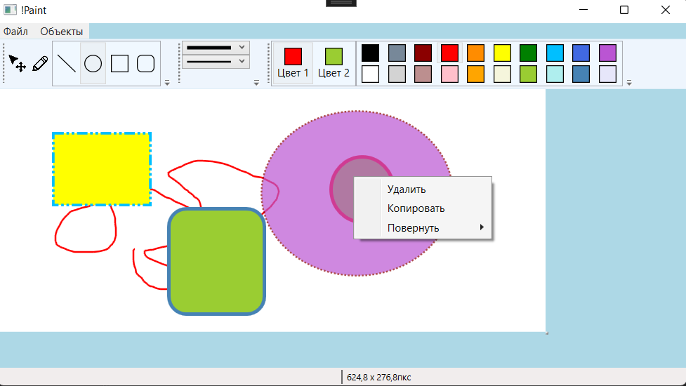

# NotPaint
This is a graphics editor application that was written with the goal of learning the basics of drawing in WPF. The app was heavily inspired by the classic Microsoft Paint application and implements its main features.
## Features
- The buttons for drawing straight lines, three types of figures and the pencil mode
- Changing the width, type and color of the line stroke and figure filling before drawing and on selecting the figure
- Moving, rotating and deleting the figures on selection
- Copying and pasting the objects onto the canvas
- Saving and loading the canvas as well as the other images
- Resizing the canvas
- Tracking the position of the cursor and the canvas size
## Screenshots
**The main page** 

## Technologies used
- .NET Framework 4.7.2
- C# 7.3
- Visual Studio 2017
## Room for improvement
- Code refactoring
- Adding more shapes
- Adding a color wheel
- Adding the Undo and Eraser buttons
